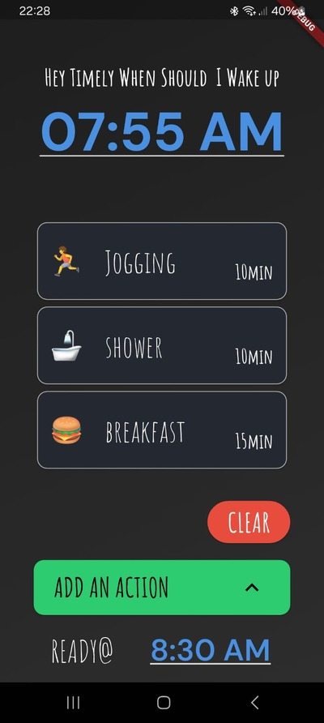
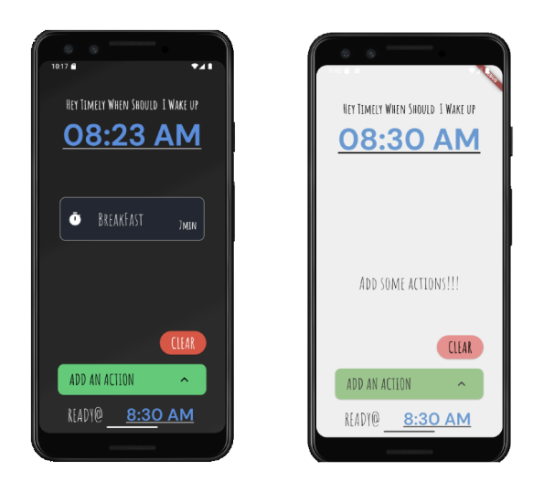
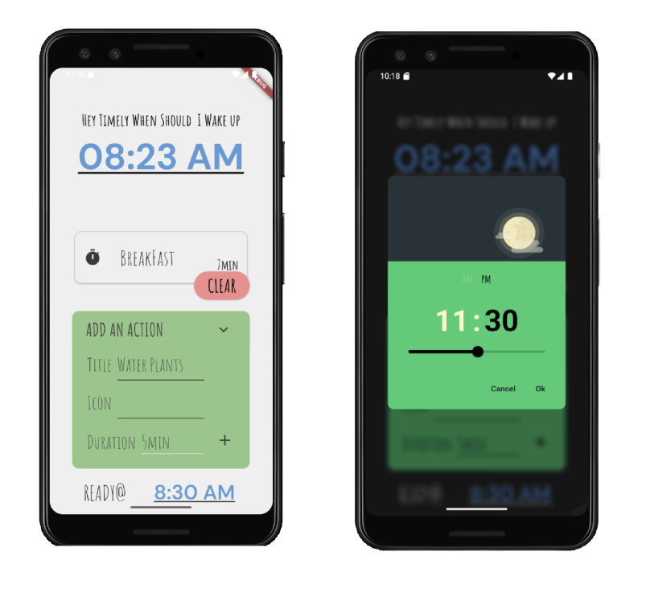

# Timely ⏰

Timely is a simple app that helps you determine the best time to wake up based on a list of tasks you need to complete before a specific deadline. Just input your required actions, their durations, and the time you need to be ready, and Timely will calculate your optimal wake-up time.
My first attempt at mobile app development and using flutter and decided on this is my first try learning mobile development and I made this simple app.s very simple app.

---

## Features 🚀

- **Smart Wake-Up Calculation**: Determines when you should wake up based on your tasks.
- **Task List Management**: Add, edit, and remove tasks with their durations.
- **User-Friendly Interface**: Simple and intuitive UI for easy planning.
- **Multiple Scenarios**: Plan wake-up times for different schedules.
- **Lightweight & Fast**: Minimal resource usage and quick calculations.

---

## Screenshots 🖼

Here are some previews of Timely in action:

### Home Screen





---

### Run the App

Ensure you have Flutter installed:

```sh
flutter pub get
flutter run
```

---

## Usage 📖

1. **Enter your required tasks**: Add the tasks you need to complete before leaving.
2. **Set the time you need to be ready**: Input your target time to be fully prepared.
3. **Calculate wake-up time**: Timely will determine when you should wake up.
4. **Optimize your routine**: Adjust tasks and duration for better scheduling.

---

## Contact ✉️

For any inquiries or feedback, reach out at [whackerfin@gmail.com](mailto:whackerfin@gmail.com).
